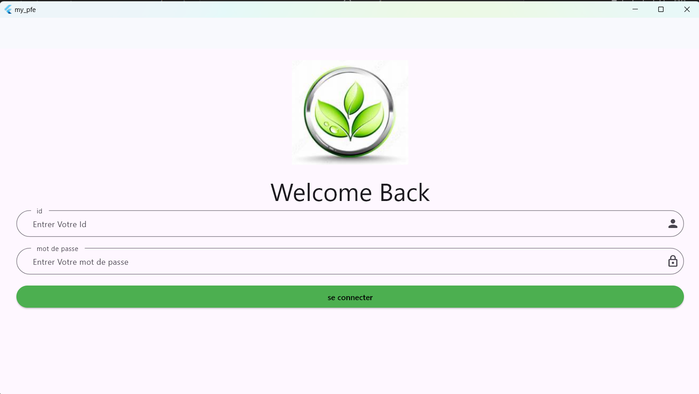

# 📱💻 Application de Gestion des Ventes et des Performances

## Objectif du Projet

L'objectif de notre projet de fin d'études en Licence, réalisé en collaboration avec [Ikram Hlal](https://github.com/hlal-ikram), est de développer une **application mobile et desktop** visant à améliorer les processus de vente et de gestion pour les vendeurs et les responsables. Cette application offrira un ensemble de fonctionnalités essentielles permettant de simplifier le travail des vendeurs sur le terrain et de permettre aux responsables de superviser et d'analyser travail des vendeurs sur le terrain et de permettre aux responsables de superviser et d'analyser les performances des vendeurs.
## Technologies Utilisées

Pour atteindre cet objectif, nous avons opté pour l'utilisation de plusieurs technologies robustes :

- 💾 **MySQL** : Utilisé comme base de données pour stocker les informations des vendeurs, des clients et des commandes, garantissant une solution solide et fiable.
- 💻 **Dart et Flutter** : Choisis pour développer une interface utilisateur fluide et cohérente sur les appareils mobiles et desktop.
- 🔄 **PHP** : Intégré pour la gestion des requêtes et des réponses entre l'application et la base de données, offrant ainsi une application performante.

## 🧑‍💼 Tâches des Responsables (Application Mobile et Desktop)

Les responsables de l'entreprise disposent d'une série de fonctionnalités pour gérer efficacement les employés et les produits de l'application :

- 🧑‍🔧 **Gestion des employés** : 
   - Le responsable peut ajouter ou supprimer des responsables et des vendeurs.
   - Possibilité de bloquer ou débloquer les vendeurs en fonction des besoins.

- 🗓️ **Consultation du planning d'affectation** : 
   - Le responsable peut consulter le planning d'affectation des employés pour une période donnée (entre deux dates spécifiées).
   - Cette fonctionnalité permet d'avoir une vue d'ensemble des affectations prévues pour chaque employé pendant cette période.

- 🛒 **Gestion des produits** : 
   - Le responsable peut ajouter de nouveaux produits avec toutes les informations nécessaires, y compris les photos.
   - Possibilité de modifier les détails des produits existants et de supprimer des produits si nécessaire.

- 🗺️ **Affectation des secteurs et des véhicules** : 
   - Le responsable peut assigner à chaque vendeur les secteurs qu'il doit visiter le lendemain, ainsi que le véhicule à utiliser pour la journée.

- 📦 **Consultation des commandes** :
   - Le responsable peut consulter les commandes de chaque vendeur avec toutes les informations liées à ces commandes.
 
## 🛍️ Tâches des Vendeurs (Application Mobile)

Les vendeurs ont accès à plusieurs fonctionnalités pour faciliter leur travail quotidien sur le terrain :

- 🗓️ **Consultation du planning** :
   - Les vendeurs peuvent consulter les secteurs qu'ils doivent visiter le lendemain ainsi que les véhicules qui leur sont attribués.

- 👥 **Ajout de clients** :
   - Lors de l'enregistrement d'une commande, les vendeurs peuvent ajouter de nouveaux clients. L'application utilise la géolocalisation pour obtenir automatiquement l'adresse du client.

- 📝 **Saisie de commandes** :
   - Les vendeurs peuvent enregistrer les commandes à charger dans le véhicule pour le lendemain, en prenant en compte le tonnage maximum pour éviter les dépassements.

- 💵 **Facturation des commandes** :
   - Les vendeurs peuvent facturer chaque commande avant l'impression, en appliquant les réductions appropriées en fonction du poids des produits. Le prix final est automatiquement calculé.

- 🖨️ **Impression de factures** :
   - Après la facturation, les vendeurs peuvent imprimer les factures pour chaque commande. Ils peuvent également fournir au client un aperçu du montant total et ajuster la quantité avant la validation si nécessaire.

 

